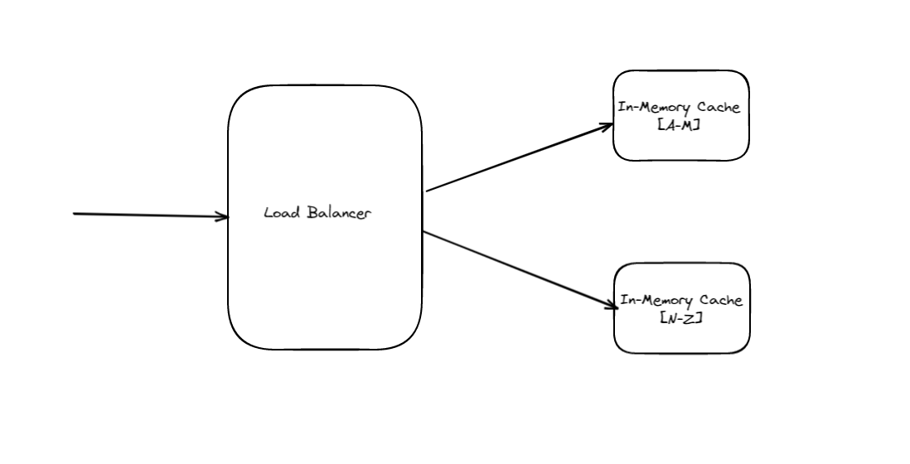
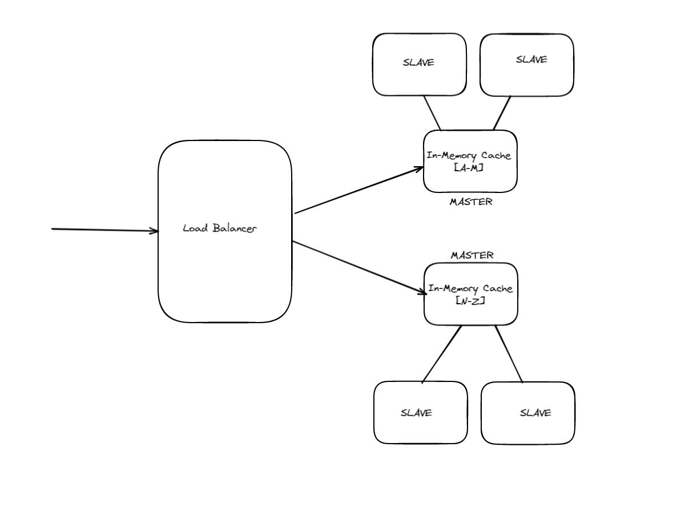

# In-Memory-Cache

This repo initially made for a coding challange for building a in-memory key-value storage app but seems like this will grow than it's initial expectations... Feel free to review or even use it.

### What's it ? 

 - It's basically a REST-API
 - It has GET, SET, DELETE & FLUSH endpoints which are self-explanatory
 - It has persistant state, meaning it saves the key-value pairs even after a reboot

### How to use it locally ?

  - Clone the repo to your machine
  - cd to In-Memory-Cache/src
  - run `go get` then `go run main.go`
  - You can see the api documentation at `http://localhost:8080/docs`
  - Send request from Postman or cURL to execute the operations

### What about container?

  - Project also has a `DOCKERFILE`
  - To Run it in a container, cd to In-Memory-Cache/src
  - `docker build --tag inmemcache .`
  - `docker run --detach --publish 8080:8080 inmemcache`

### What about online?

  - It's deployed to GCP, you can see the swagger doc at http://34.159.135.206:8080/docs

### Operations

  - GET(key) : Gets the value of key |  path: v1/{key}
  - SET(key, value) : Adds new record where map[key]=value | path: v1/{key}  | body: {value} (text/plain)
  - DELETE(key) : Deletes the record of given key | path: v1/{key}
  - FLUSH() : Deletes entire dictionary  | path: /flush

### Advantages
 
 - All operations depending on Go's map, which is a hash map that has O(1) look up 
 - Thread-safe operations
 - -For now- kinda scalable, will be turn into highly scalable and highly available

### To-Do

  - First goal is to re-write endpoints properly to load-balance to its shards
  

    
     
  

  - Needs proper testing. There are few tests available but needs extensive test cases
  - Still not highly available. Needs master-slave to ensure availability
  

    
     
  

  - Needs system monitor/health checker service when service counts goes up
  - Needs to fix Swagger, it does not properly tests endpoints
